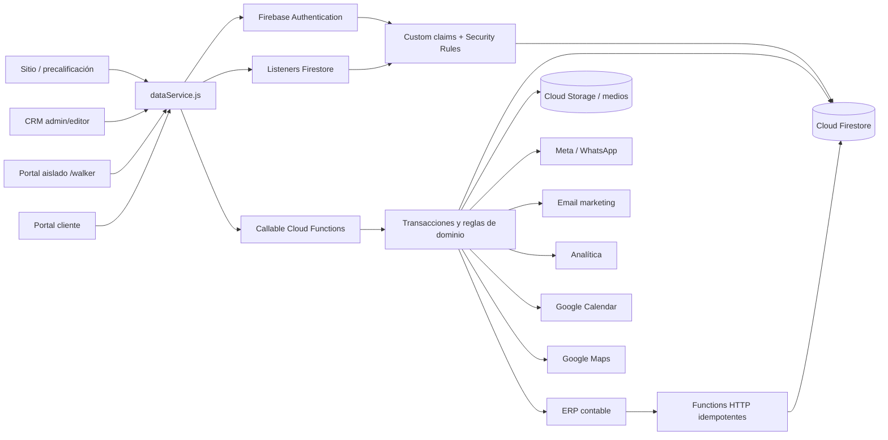
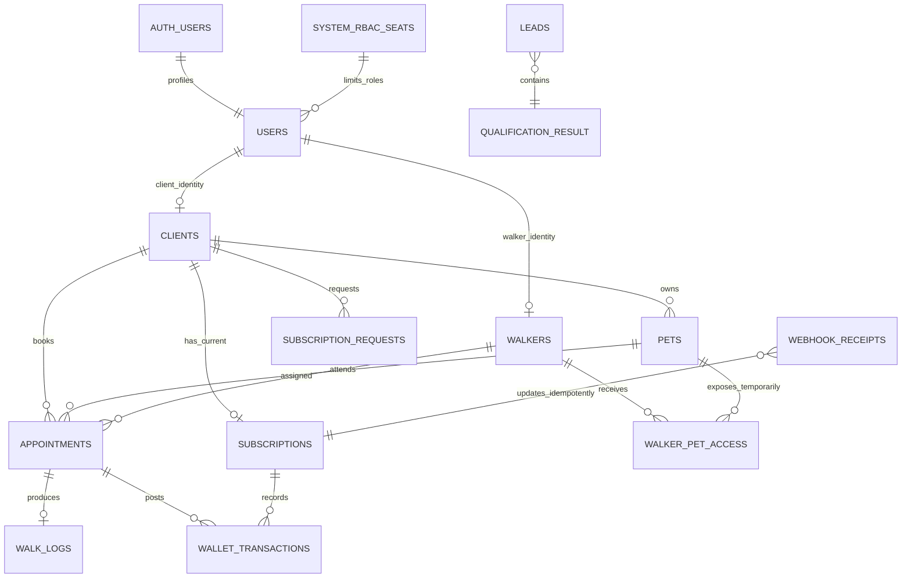

# Pura Vida Pets - Arquitectura backend, lógica de negocio y datos

**Estado:** arquitectura Firebase implementada v2

**Fecha:** 2026-08-09

**Zona horaria de negocio:** `America/Costa_Rica`

**Propietario funcional:** Adrián Arias Pochet

**Alcance:** backend, lógica de negocio, datos, seguridad e integraciones. Las vistas funcionales mínimas solo exponen estos casos de uso; no constituyen un rediseño visual.

## 1. Resumen ejecutivo

La implementación vigente usa **Firebase Authentication, Cloud Firestore y Cloud Functions v2**. `src/utils/dataService.js` es el adaptador único consumido por React; los listeners `onSnapshot` entregan cambios en tiempo real y las mutaciones sensibles se ejecutan en Functions mediante transacciones. Esta forma es proporcional al volumen inicial - entre 6 y 15 usuarios operativos diarios y un orden de 100 a 1.000 registros indicado en el onboarding - y evita el coste operativo de microservicios prematuros.

Los límites internos se diseñan como módulos que pueden extraerse posteriormente sin romper contratos:

- `identity-access`: autenticación, RBAC, sesiones y auditoría.
- `prospecting`: prospectos, consentimiento y pre-calificación.
- `customers`: clientes, direcciones y contactos.
- `pets`: mascotas, salud e instrucciones de cuidado.
- `workforce`: paseadores, disponibilidad y zonas.
- `subscriptions`: planes, periodos y billetera de minutos.
- `scheduling`: citas, asignaciones, reportes y ubicación temporal.
- `billing`: facturas, transacciones, reembolsos y conciliación.
- `integrations`: Outbox, webhooks, adaptadores y vínculos externos.

El CRM y el portal de paseadores son **superficies de autorización separadas**. Un paseador nunca recibe acceso al CRM ni a endpoints genéricos de clientes o mascotas; solo consume endpoints `walker/me/*`, con datos filtrados por su asignación y por una ventana temporal.

## 2. Decisiones y conformidad con Elysium

### 2.1 Decisiones vinculantes

| ID | Decisión |
|---|---|
| ADR-001 | Empezar con un backend serverless modular en Cloud Functions, no con microservicios distribuidos. |
| ADR-002 | Cloud Firestore es la fuente de verdad operacional; Firebase Authentication aporta identidad y custom claims. |
| ADR-003 | La aplicación usa callable Functions para comandos y listeners Firestore para consultas en tiempo real; no se habilita GraphQL inicialmente. |
| ADR-004 | Toda integración externa entra por webhooks idempotentes y publica efectos derivados desde Functions. Calendario, WhatsApp y ERP son proyecciones, no fuentes maestras. |
| ADR-005 | El saldo visible se mantiene en un resumen transaccional de minutos y cada reserva/consumo genera un documento inmutable en `walletTransactions`. |
| ADR-006 | La autorización combina RBAC con condiciones por fila, asignación, estado y tiempo. |
| ADR-007 | Los datos médicos de mascotas, financieros, direcciones detalladas y ubicación se separan y auditan. |

### 2.2 Conformidad con F18

Elysium F18 prescribe Firebase Authentication, Firestore, reglas por rol, anti-escalada, funciones de servidor y Secret Manager. La decisión posterior del cliente de usar `src/utils/dataService.js` como frontera Firebase sustituye la propuesta inicial de PostgreSQL y elimina la desviación.

La implementación queda resuelta así:

- Firebase Authentication gestiona sesiones y custom claims `role`.
- Firestore Security Rules aplican RBAC, propiedad, asignación y acceso temporal.
- Cloud Functions aplica transacciones, estados, cupos y webhooks con privilegio de servidor.
- Se conserva anti-escalada de privilegios, validación de esquema, funciones de servidor, secretos fuera del repositorio y auditoría.
- `src/core/` mantiene lógica de negocio pura; `src/features/` mantiene módulos autocontenidos; `functions/` o el servicio backend contiene todo código de servidor.
- La implementación actual conserva el contrato JavaScript solicitado; una migración posterior a TypeScript estricto no debe modificar `dataService.js` desde el punto de vista de sus consumidores. Los secretos permanecen en Secret Manager o variables de entorno seguras.

### 2.3 Controles Elysium aplicables

- Compliance by design: analítica y marketing solo con consentimiento válido.
- CSP estricta y credenciales fuera del repositorio.
- Estado go-live: sin `console.log` de depuración, código muerto ni datos mock en producción.
- Versionado del sitio en una única fuente con formato Elysium `VAÑO.MAYOR.MENOR`; las APIs internas pueden usar semver independientemente.
- Despliegue manual salvo autorización explícita de una persona en esa conversación.
- Auditoría bloqueante de seguridad, pruebas y migraciones antes de producción.

## 3. Arquitectura lógica



### 3.1 Componentes de ejecución

1. **Callable Functions:** validan identidad/rol, ejecutan casos de uso y confirman transacciones Firestore atómicas.
2. **Triggers y tareas programadas:** publican integraciones, aplican reintentos y envían fallos permanentes a una cola muerta administrada.
3. **Functions HTTP de webhooks:** verifican autenticidad, persisten el evento de forma idempotente y responden rápido; el trabajo pesado ocurre después.
4. **Programador de tareas:** renueva periodos, expira créditos, renueva canales de calendario, reconcilia pagos y purga datos temporales.
5. **Almacenamiento de objetos:** fotos, vídeos y documentos con URLs firmadas de corta duración. La base de datos guarda metadatos, no binarios.

### 3.2 Reglas técnicas transversales

- IDs aleatorios de Firestore o UIDs de Firebase Auth; nunca IDs secuenciales expuestos públicamente.
- Tiempos almacenados como `Timestamp`; reglas comerciales calculadas en `America/Costa_Rica`.
- Dinero como enteros en la unidad menor más moneda ISO 4217; nunca `float`.
- Duraciones y saldo en minutos enteros; nunca horas decimales como fuente de verdad.
- Toda mutación acepta `Idempotency-Key` y devuelve el mismo resultado ante repetición válida.
- Actualizaciones concurrentes sensibles usan `runTransaction`; las Functions son reentrantes e idempotentes.
- Las callable Functions devuelven códigos `HttpsError`; los webhooks HTTP usan estados y cuerpos mínimos.
- Listados usan cursores/`limit`, filtros permitidos e índices compuestos declarados.
- Datos sensibles se cifran en reposo y se excluyen de logs, trazas, URLs y mensajes de WhatsApp.

## 4. Gestión de suscripciones y billetera de horas

### 4.1 Catálogo confirmado

| Plan | Minutos/mes | Beneficios del prototipo |
|---|---:|---|
| Básico | 480 | Paseos guiados, hidratación, cuidado básico, fotos/vídeos semanales y limpieza menor imprevista. |
| Pura Vida | 720 | Todo Básico, rutas activas personalizadas, actividades y cepillado en cada salida. |
| Premium | 1.200 | Todo Pura Vida, grooming mensual y prioridad VIP. |

Los precios no aparecen en las fuentes recibidas. Se versionan en `plan_prices` y no se incrustan en código.

### 4.2 Estados

```text
PENDING_PAYMENT -> ACTIVE -> PAST_DUE -> ACTIVE
                         \-> PAUSED -> ACTIVE
ACTIVE -> CANCEL_AT_PERIOD_END -> CANCELED
PENDING_PAYMENT -> CANCELED
PAST_DUE -> CANCELED
```

Reglas:

- Solo un periodo facturable puede estar abierto por suscripción.
- Un cliente puede tener cambios programados, pero solo una suscripción `ACTIVE`, `PAST_DUE`, `PAUSED` o `CANCEL_AT_PERIOD_END` a la vez.
- El alta queda `PENDING_PAYMENT` hasta que un webhook de pago válido confirme cobro.
- La renovación es idempotente por `(subscription_id, period_start)`.
- `PAST_DUE` impide crear nuevas reservas que excedan créditos ya pagados; no borra citas existentes automáticamente.
- Cancelar al fin de periodo no elimina créditos antes de su fecha de expiración.
- Un downgrade se aplica en la siguiente renovación. Un upgrade puede aplicarse de inmediato solo después de cobrar la diferencia y registrar el crédito prorrateado.

### 4.3 Libro mayor de minutos

Tipos de asiento:

- `PERIOD_GRANT`: crédito mensual tras pago confirmado.
- `PRORATION_GRANT`: crédito adicional por upgrade.
- `MANUAL_ADJUSTMENT`: corrección administrativa con motivo obligatorio.
- `APPOINTMENT_DEBIT`: minutos consumidos por cita completada.
- `CANCELLATION_FEE`: penalización definida por política.
- `REFUND_CREDIT`: devolución de minutos.
- `EXPIRATION_DEBIT`: expiración al cerrar el periodo.

Las reservas pendientes se controlan con `wallet_holds`, no con asientos definitivos.

```text
saldo_contable = SUM(wallet_entries.amount_minutes)
saldo_disponible = saldo_contable - SUM(wallet_holds.minutes WHERE status = 'ACTIVE')
```

Invariantes:

- `saldo_disponible >= 0` después de cada confirmación, salvo ajuste administrativo explícito.
- Cada cita tiene como máximo un hold activo.
- Cada cita completada tiene como máximo un `APPOINTMENT_DEBIT` efectivo.
- Un asiento es inmutable; una corrección crea un asiento compensatorio.
- El saldo mostrado puede materializarse como caché, pero se reconcilia contra el libro mayor.

### 4.4 Flujo de reserva y consumo

1. Bloquear la cuenta de billetera del cliente.
2. Validar suscripción, periodo, zona, mascota, disponibilidad y duración.
3. Calcular minutos estimados y saldo disponible.
4. Para una cita pagada con suscripción, crear `appointment` y `wallet_hold` en la misma transacción. Una cita individual usa `PENDING_PAYMENT` hasta confirmar su cobro.
5. Al cancelar a tiempo: liberar hold sin asiento.
6. Al cancelar tarde: liberar hold y crear `CANCELLATION_FEE` según la política versionada.
7. Al completar: medir minutos facturables, liberar hold y crear un solo `APPOINTMENT_DEBIT`.
8. Si los minutos reales superan el hold, exigir saldo restante o aprobación administrativa; nunca generar saldo negativo silencioso.

### 4.5 Renovación mensual

1. El proveedor de pagos intenta el cobro.
2. El webhook se verifica y persiste con `provider_event_id` único.
3. `invoice.paid` activa o renueva la suscripción.
4. Se crea `subscription_period` y un `PERIOD_GRANT` por los minutos de la versión contratada.
5. La Outbox publica `subscription.renewed`.
6. Calendar, email, analítica y ERP consumen el evento de forma independiente.
7. Un reconciliador diario compara facturas internas con el proveedor y el ERP.

### 4.6 Políticas configurables que requieren confirmación comercial

- Precio y moneda de cada plan.
- Fecha de anclaje mensual.
- Renovación automática y días de gracia.
- Redondeo de duración facturable.
- Rollover o expiración de minutos no usados. Valor inicial recomendado: sin rollover.
- Ventana y penalización de cancelación tardía.
- Política de no-show, pausas, impuestos, grooming y servicios adicionales.

## 5. Pre-calificación de prospectos

### 5.1 Principios

- Algoritmo determinista, versionado y explicable; no se usa un modelo opaco.
- La edad exacta no se solicita ni se usa para rechazo. El sistema verifica mayoría de edad y clasifica por necesidad operativa.
- La raza no produce rechazo automático. El comportamiento, capacidad de manejo e incidentes previos disparan revisión de seguridad.
- El consentimiento de marketing nunca es requisito para recibir una respuesta.
- Ningún dato médico de mascota se inserta en la URL de WhatsApp.
- Solo `QUALIFIED` recibe el enlace de handoff; `MANUAL_REVIEW` va a una cola interna.

### 5.2 Entradas mínimas

- Mayoría de edad y consentimiento de privacidad.
- Ubicación o Place ID, distrito y tipo de zona.
- Tipo y cantidad de mascotas.
- Tamaño/peso aproximado, nivel de energía, conducta con personas y animales, historial de mordida o fuga.
- Necesidad principal, frecuencia y fecha de inicio.
- Rutina del hogar: jornada fija, horarios rotativos, tiempo fuera de casa, dificultad de coordinación o limitación física.
- Interés en plan mensual.
- Nombre, teléfono WhatsApp y autorización explícita para iniciar conversación.

### 5.3 Reglas de puerta

| Código | Resultado | Regla |
|---|---|---|
| `UNDERAGE` | `NOT_FIT` | No puede prestar consentimiento válido; se solicita contacto de responsable adulto. |
| `OUTSIDE_SERVICE_ZONE` | `NOT_FIT` | Ubicación fuera de polígonos activos o zona rural no cubierta. |
| `UNSUPPORTED_SERVICE` | `NOT_FIT` | Solicita emergencia veterinaria u otro servicio no ofrecido. |
| `GEO_UNCERTAIN` | `MANUAL_REVIEW` | Dirección ambigua, límite de zona o geocodificación de baja confianza. |
| `SAFETY_REVIEW` | `MANUAL_REVIEW` | Mordida grave, agresión no evaluada, fuga recurrente o manejo incompatible. |
| `MEDICAL_REVIEW` | `MANUAL_REVIEW` | Necesidad médica que exige protocolo especial antes de reservar. |
| `NO_PRIVACY_CONSENT` | `NOT_PROCESSED` | No se persiste más información de la necesaria para demostrar la negativa. |

### 5.4 Puntaje de encaje comercial

```text
service_fit = zone + recurring_need + schedule_need + pet_suitability + monthly_intent + start_window
```

| Dimensión | Máximo | Criterio resumido |
|---|---:|---|
| Cobertura | 25 | 25 dentro de zona activa; 10 en límite; 0 fuera. |
| Necesidad recurrente | 20 | 20 para 2+ servicios/semana; 12 para 1/semana; 5 ocasional. |
| Necesidad de agenda | 20 | Tiempo insuficiente, horarios rotativos o limitación física demostrada por respuestas. |
| Idoneidad de mascota | 20 | 20 sin alertas; 10 con información incompleta; revisión si existe riesgo. |
| Interés mensual | 10 | 10 acepta paquete; 5 requiere asesoría; 0 solo consulta sin intención. |
| Inicio | 5 | 5 hasta 30 días; 3 hasta 90; 0 más adelante. |

### 5.5 Puntajes de persona

Cada persona se calcula independientemente de 0 a 100; un prospecto puede pertenecer a varias.

```text
BUSY_PROFESSIONAL = full_time_job(30) + fixed_weekday_schedule(20)
                  + away_6h_or_more(20) + insufficient_time(20)
                  + recurring_need(10)

ROTATING_COUPLE = household_with_2_adults(15) + rotating_schedules(35)
                + weekly_variability(20) + coordination_difficulty(20)
                + multiple_pets(10)

MOBILITY_SUPPORT = self_reported_mobility_limit(40) + requests_physical_assistance(25)
                 + recurring_need(15) + regularly_at_home(10)
                 + pet_pull_risk(10)
```

`pet_pull_risk` suma afinidad con la necesidad, pero también puede activar `SAFETY_REVIEW`; nunca convierte por sí solo una solicitud en apta.

### 5.6 Decisión

```pseudo
function evaluate(input, ruleVersion):
    validatePrivacyAndSchema(input)
    gate = evaluateHardGates(input)

    if gate == NOT_PROCESSED:
        return NOT_PROCESSED
    if gate in [UNDERAGE, OUTSIDE_SERVICE_ZONE, UNSUPPORTED_SERVICE]:
        return NOT_FIT with reason_codes

    serviceFit = scoreServiceFit(input, ruleVersion)
    personaScores = scorePersonas(input, ruleVersion)
    persona = max(personaScores)

    if gate requires review:
        return MANUAL_REVIEW
    if serviceFit >= 70 and persona.score >= 60 and input.whatsapp_opt_in:
        return QUALIFIED with persona and signed_handoff_token
    if serviceFit >= 50 or persona.score >= 45:
        return MANUAL_REVIEW
    if serviceFit >= 40 and input.marketing_opt_in:
        return NURTURE
    return NOT_FIT
```

El resultado persiste `rule_version`, puntajes, `reason_codes` y respuestas que influyeron en la decisión. Cambiar pesos crea una nueva versión; nunca reescribe resultados históricos.

### 5.7 Handoff a WhatsApp

1. `POST /public/qualifications` evalúa y devuelve resultado.
2. Un resultado `QUALIFIED` incluye un token firmado, de un solo uso y duración corta.
3. `POST /public/qualifications/{id}/whatsapp-handoff` valida token y consentimiento.
4. Registra `lead.handoff_requested` y genera mensaje con nombre, plan sugerido y código de prospecto.
5. La URL no contiene salud, dirección, respuestas, puntuación ni notas internas.
6. La conversación entrante se vincula por código o teléfono normalizado, sin crear duplicados.

## 6. Modelo de datos Firestore

Firestore es el almacenamiento físico vigente. Las relaciones se representan mediante IDs estables (`clientId`, `petId`, `walkerId`, `appointmentId`) y se validan en Cloud Functions y Security Rules. El modelo relacional normalizado conservado más abajo funciona solo como referencia conceptual para auditoría, analítica o una futura exportación; no describe colecciones desplegadas.

### 6.1 ERD físico en formato texto Mermaid



| Colección/documento | ID | Relaciones y campos vinculantes |
|---|---|---|
| `users/{uid}` | Firebase Auth UID | `role`, `displayName`, `status`; el usuario nunca modifica `role`. |
| `clients/{uid}` | Firebase Auth UID | Perfil CRM del cliente; coincide con `clientId`. |
| `pets/{petId}` | ID aleatorio | `ownerId -> users/{uid}`; `health` solo para dueño, CRM o acceso temporal. |
| `walkers/{uid}` | Firebase Auth UID | Perfil laboral privado; clientes consumen perfiles públicos separados si fueran necesarios. |
| `subscriptions/{clientId}` | UID de cliente | Una suscripción corriente por cliente; `wallet.totalMinutes`, `consumedMinutes`, `reservedMinutes`. |
| `subscriptionRequests/{id}` | ID aleatorio | `clientId`, `planId`, `status=pending_payment`; no activa saldo desde el navegador. |
| `appointments/{id}` | ID aleatorio | `clientId`, `petId`, `walkerId`, `subscriptionId`, `scheduledStartAt`, `durationMinutes`, `status`. |
| `walkLogs/{appointmentId}` | ID de cita | Bitácora idempotente de la cita completada, medios y minutos efectivos. |
| `walletTransactions/{id}` | ID determinista por cita/tipo | Libro append-only: `reservation_hold` y `service_consumption`. |
| `walkerPetAccess/{walkerId_petId}` | ID compuesto | Acceso denormalizado con `appointmentId`, `activeFrom`, `activeUntil`. |
| `leads/{id}` | ID aleatorio | Respuestas permitidas, resultado versionable, buyer persona y plan recomendado. |
| `system/rbacSeats` | ID fijo | Contadores transaccionales con máximos `admin=3`, `editor=5`. |
| `webhookReceipts/{provider_eventId}` | ID determinista | Dedupe de eventos externos antes de modificar suscripciones/ERP. |

Los índices físicos viven en `firestore.indexes.json`; las reglas de acceso, en `firestore.rules`. Ninguna Function de Admin SDK confía en datos de rol enviados por el cliente.

### 6.2 Modelo lógico normalizado de referencia

```mermaid
erDiagram
    USERS ||--o{ USER_ROLES : has
    ROLES ||--o{ USER_ROLES : assigned
    ROLES ||--o{ ROLE_PERMISSIONS : grants
    PERMISSIONS ||--o{ ROLE_PERMISSIONS : contains
    USERS o|--o| CLIENTS : represents
    USERS ||--o| WALKERS : represents

    CLIENTS ||--o{ CLIENT_ADDRESSES : owns
    CLIENTS ||--o{ PETS : owns
    PETS ||--|| PET_HEALTH_PROFILES : has
    CLIENTS ||--o{ CONSENTS : grants

    SERVICE_ZONES ||--o{ WALKER_SERVICE_ZONES : covers
    WALKERS ||--o{ WALKER_SERVICE_ZONES : serves
    WALKERS ||--o{ WALKER_AVAILABILITY : declares

    PLANS ||--o{ PLAN_VERSIONS : versions
    PLAN_VERSIONS ||--o{ PLAN_VERSION_FEATURES : includes
    PLAN_FEATURES ||--o{ PLAN_VERSION_FEATURES : defines
    PLAN_VERSIONS ||--o{ PLAN_PRICES : prices
    CLIENTS ||--o{ SUBSCRIPTIONS : subscribes
    PLAN_VERSIONS ||--o{ SUBSCRIPTIONS : selected
    SUBSCRIPTIONS ||--o{ SUBSCRIPTION_PERIODS : renews
    SUBSCRIPTIONS ||--|| WALLET_ACCOUNTS : owns
    WALLET_ACCOUNTS ||--o{ WALLET_ENTRIES : posts
    WALLET_ACCOUNTS ||--o{ WALLET_HOLDS : reserves

    CLIENTS ||--o{ APPOINTMENTS : books
    CLIENT_ADDRESSES ||--o{ APPOINTMENTS : occurs_at
    APPOINTMENTS ||--o{ APPOINTMENT_PETS : includes
    PETS ||--o{ APPOINTMENT_PETS : attends
    APPOINTMENTS ||--o{ APPOINTMENT_ASSIGNMENTS : staffed_by
    WALKERS ||--o{ APPOINTMENT_ASSIGNMENTS : receives
    APPOINTMENTS ||--o{ APPOINTMENT_EVENTS : transitions
    APPOINTMENTS ||--o| SERVICE_REPORTS : produces
    APPOINTMENTS ||--o{ MEDIA_ASSETS : documents
    APPOINTMENTS ||--o| TRACKING_SESSIONS : tracks
    TRACKING_SESSIONS ||--o{ LOCATION_SAMPLES : samples
    APPOINTMENTS ||--o| WALLET_HOLDS : backs

    CLIENTS ||--o{ INVOICES : billed
    SUBSCRIPTION_PERIODS o|--o| INVOICES : charges
    INVOICES ||--o{ PAYMENT_TRANSACTIONS : paid_by
    PAYMENT_TRANSACTIONS ||--o{ REFUNDS : refunded_by

    PROSPECTS ||--o{ QUALIFICATION_SUBMISSIONS : submits
    QUALIFICATION_SUBMISSIONS ||--o{ QUALIFICATION_ANSWERS : answers
    QUALIFICATION_SUBMISSIONS ||--o{ QUALIFICATION_SCORES : scored
    PROSPECTS ||--o{ CONSENTS : grants
    PROSPECTS o|--o| CLIENTS : converts_to

    USERS o|--o{ OUTBOX_EVENTS : causes
    USERS ||--o{ AUDIT_LOGS : acts

    WEBHOOK_RECEIPTS {
        uuid id PK
    }
    EXTERNAL_OBJECT_LINKS {
        uuid id PK
    }
```



#### 6.2.1 Identidad y permisos

| Tabla | PK y campos principales | FKs y restricciones |
|---|---|---|
| `users` | `id`, `auth_subject`, `email`, `phone_e164`, `status`, `last_login_at` | `auth_subject` único; email normalizado único cuando existe. |
| `roles` | `id`, `code`, `name`, `system_role` | `code` único: `ADMIN`, `EDITOR`, `WALKER`, `CLIENT`, `SERVICE`. |
| `permissions` | `id`, `code`, `resource`, `action` | `code` único. |
| `user_roles` | `(user_id, role_id)`, `valid_from`, `valid_until`, `granted_by` | FKs a `users`, `roles`; no autoasignación. |
| `role_permissions` | `(role_id, permission_id)` | FKs a `roles`, `permissions`. |
| `role_seat_limits` | `role_id`, `max_active` | `ADMIN=3`, `EDITOR=5`; cambio solo con control administrativo. |
| `access_approvals` | `id`, `operation`, `subject_user_id`, `requested_by`, `approved_by`, `status` | Solicitante y aprobador distintos para altas de admin/exportaciones sensibles. |
| `audit_logs` | `id`, `actor_user_id`, `action`, `resource_type`, `resource_id`, `reason`, `before_hash`, `after_hash`, `created_at` | Append-only; sin datos médicos o secretos en claro. |

La asignación de roles toma un bloqueo transaccional sobre `role_seat_limits`, cuenta asignaciones activas y rechaza cualquier exceso. En el arranque productivo se exige exactamente 3 administradores y 5 editores activos. Una sustitución transfiere el rol en una sola transacción; una suspensión de emergencia puede dejar temporalmente menos cuentas y genera una alerta crítica, pero nunca habilita una cuarta cuenta administradora ni una sexta editora.

#### 6.2.2 Clientes, mascotas y paseadores

| Tabla | PK y campos principales | FKs y restricciones |
|---|---|---|
| `clients` | `id`, `user_id`, `full_name`, `email`, `whatsapp_e164`, `status`, `source`, `converted_from_prospect_id` | FKs opcionales a `users` y `prospects`; `converted_from_prospect_id` único; teléfono normalizado. |
| `client_addresses` | `id`, `client_id`, `label`, `formatted_address`, `place_id`, `latitude`, `longitude`, `service_zone_id`, `access_instructions_ciphertext`, `active` | FK a `clients`, `service_zones`; coordenadas válidas. |
| `pets` | `id`, `client_id`, `name`, `species`, `breed_text`, `birth_date`, `weight_kg`, `energy_level`, `temperament_summary`, `status` | FK a `clients`; baja lógica. |
| `pet_health_profiles` | `pet_id`, `allergies_ciphertext`, `conditions_ciphertext`, `medications_ciphertext`, `vaccination_notes_ciphertext`, `handling_flags`, `updated_by` | PK/FK a `pets`; acceso auditado. |
| `pet_care_instructions` | `id`, `pet_id`, `category`, `instruction_ciphertext`, `active_from`, `active_until` | FK a `pets`; versionado temporal. |
| `walkers` | `id`, `user_id`, `display_name`, `status`, `max_pet_weight_kg`, `emergency_phone_e164` | FK única a `users`; nunca recibe rol CRM. |
| `walker_availability` | `id`, `walker_id`, `starts_at`, `ends_at`, `status`, `recurrence_rule` | FK a `walkers`; `ends_at > starts_at`. |
| `service_zones` | `id`, `name`, `polygon`, `status`, `priority` | Geometría válida; controla cobertura. |
| `walker_service_zones` | `(walker_id, service_zone_id)` | FKs a `walkers`, `service_zones`. |

#### 6.2.3 Planes y suscripciones

| Tabla | PK y campos principales | FKs y restricciones |
|---|---|---|
| `plans` | `id`, `code`, `name`, `status` | `code` único: `BASIC`, `PURA_VIDA`, `PREMIUM`. |
| `plan_versions` | `id`, `plan_id`, `version_no`, `included_minutes`, `effective_from`, `effective_until` | FK a `plans`; versión única por plan; periodos no solapados. |
| `plan_features` | `id`, `code`, `name`, `value_type` | `code` único; catálogo normalizado de beneficios. |
| `plan_version_features` | `(plan_version_id, feature_id)`, `included_value` | FKs a versión/beneficio; valor validado según `value_type`. |
| `plan_prices` | `id`, `plan_version_id`, `currency`, `amount`, `billing_interval`, `tax_behavior` | FK a `plan_versions`; `amount >= 0`. |
| `subscriptions` | `id`, `client_id`, `plan_version_id`, `status`, `provider_subscription_ref`, `anchor_day`, `cancel_at_period_end`, `next_plan_version_id`, `version` | FKs a `clients`, `plan_versions`; una activa por cliente. |
| `subscription_periods` | `id`, `subscription_id`, `starts_at`, `ends_at`, `status`, `included_minutes`, `closed_at` | FK; `(subscription_id, starts_at)` único. |
| `wallet_accounts` | `id`, `subscription_id`, `status` | FK única a `subscriptions`. |
| `wallet_entries` | `id`, `wallet_account_id`, `period_id`, `appointment_id`, `type`, `amount_minutes`, `idempotency_key`, `reason`, `created_by` | FKs; `idempotency_key` único; inmutable. |
| `wallet_holds` | `id`, `wallet_account_id`, `appointment_id`, `minutes`, `status`, `expires_at`, `released_at` | Una activa por cita; `minutes > 0`. |

#### 6.2.4 Citas, agenda y seguimiento

| Tabla | PK y campos principales | FKs y restricciones |
|---|---|---|
| `appointments` | `id`, `client_id`, `address_id`, `service_type`, `status`, `scheduled_start`, `scheduled_end`, `estimated_minutes`, `actual_minutes`, `priority`, `notes_ciphertext`, `version` | FKs a cliente/dirección; fin posterior a inicio. |
| `appointment_pets` | `(appointment_id, pet_id)`, `care_snapshot_id` | FKs; solo mascotas del cliente de la cita. |
| `appointment_assignments` | `id`, `appointment_id`, `walker_id`, `role`, `status`, `assigned_at`, `accepted_at` | FKs; un paseador primario activo. |
| `appointment_events` | `id`, `appointment_id`, `from_status`, `to_status`, `actor_user_id`, `reason`, `created_at` | Append-only; toda transición registrada. |
| `service_reports` | `id`, `appointment_id`, `walker_id`, `summary`, `incident_flag`, `completed_at` | Una versión efectiva por cita; cambios auditados. |
| `media_assets` | `id`, `appointment_id`, `object_key`, `media_type`, `checksum`, `visibility`, `created_by` | No guarda binario; URL firmada al leer. |
| `tracking_sessions` | `id`, `appointment_id`, `walker_id`, `starts_at`, `ends_at`, `status` | Una sesión activa por cita/paseador. |
| `location_samples` | `id`, `tracking_session_id`, `recorded_at`, `latitude`, `longitude`, `accuracy_m` | Retención corta; particionada por fecha. |

Se añade una restricción de exclusión para impedir asignaciones que se solapen para el mismo paseador en estados `ASSIGNED`, `ACCEPTED` o `IN_PROGRESS`.

#### 6.2.5 Facturación y transacciones

| Tabla | PK y campos principales | FKs y restricciones |
|---|---|---|
| `invoices` | `id`, `client_id`, `subscription_period_id`, `number`, `currency`, `subtotal`, `tax`, `total`, `status`, `due_at`, `paid_at` | Número único; FK a cliente/periodo. |
| `payment_transactions` | `id`, `invoice_id`, `provider`, `provider_transaction_ref`, `type`, `amount`, `currency`, `status`, `idempotency_key`, `processed_at` | Refs e idempotencia únicas por proveedor. |
| `refunds` | `id`, `payment_transaction_id`, `amount`, `reason`, `status`, `approved_by`, `provider_ref` | FK a transacción; total reembolsado no excede capturado. |
| `accounting_exports` | `id`, `invoice_id`, `erp_provider`, `external_ref`, `status`, `last_error_code` | FK a factura; no duplica por versión. |

Nunca se almacenan PAN, CVV ni credenciales de pago; solo referencias tokenizadas del proveedor.

#### 6.2.6 Prospectos, consentimiento e integraciones

| Tabla | PK y campos principales | FKs y restricciones |
|---|---|---|
| `prospects` | `id`, `name`, `email`, `whatsapp_e164`, `source`, `status` | Dedupe por identidad normalizada; la conversión se referencia una sola vez desde `clients.converted_from_prospect_id`. |
| `qualification_rule_versions` | `id`, `version`, `rules_json`, `effective_from`, `retired_at` | Inmutable después de activar. |
| `qualification_submissions` | `id`, `prospect_id`, `rule_version_id`, `outcome`, `submitted_at`, `handoff_token_hash` | FKs; conserva explicación. |
| `qualification_answers` | `id`, `submission_id`, `question_code`, `answer_ciphertext` | Código/version únicos por envío; respuestas de seguridad o salud cifradas. |
| `qualification_scores` | `id`, `submission_id`, `score_type`, `score`, `reason_codes` | Tipos: `SERVICE_FIT` y tres personas. |
| `consents` | `id`, `prospect_id`, `client_id`, `purpose`, `status`, `policy_version`, `captured_at`, `revoked_at`, `evidence_hash` | Exactamente un sujeto; historial append-only. |
| `outbox_events` | `id`, `aggregate_type`, `aggregate_id`, `event_type`, `payload_json`, `occurred_at`, `published_at`, `attempts` | Se inserta en la transacción del dominio. |
| `webhook_receipts` | `id`, `provider`, `provider_event_id`, `headers_hash`, `payload_encrypted`, `received_at`, `status` | `(provider, provider_event_id)` único. |
| `external_object_links` | `id`, `provider`, `local_type`, `local_id`, `external_type`, `external_id`, `sync_version` | Vínculo único por sistema/objeto. |

## 7. RBAC y autorización contextual

### 7.1 Roles y cupos

- **Administrador - 3 cuentas activas:** configuración, seguridad, catálogo, finanzas, integraciones, exportaciones y acceso total auditado.
- **Editor - 5 cuentas activas:** operación diaria de clientes, mascotas, agenda y suscripciones; sin RBAC, secretos, precios, reembolsos, exportaciones masivas ni borrado de auditoría.
- **Paseador:** sin acceso al CRM. Agenda propia y datos mínimos de las citas asignadas.
- **Cliente:** datos propios, mascotas, billetera, citas, reportes y consentimientos.
- **Servicio de integración:** credencial máquina-a-máquina con permisos mínimos por adaptador; sin login humano.

### 7.2 Matriz de permisos

| Recurso/acción | Administrador | Editor | Paseador | Cliente |
|---|---|---|---|---|
| Entrar al CRM | Sí | Sí | **No** | No |
| Usuarios y roles | CRUD; alta de admin con doble aprobación | No | No | Propio perfil limitado |
| Clientes/contactos | CRUD, exportación auditada | CRUD, sin exportación masiva | Solo campos mínimos por cita asignada | Solo propio |
| Mascotas básicas | CRUD | CRUD | Lectura por cita asignada | CRUD propias |
| Salud/instrucciones | CRUD + auditoría | CRUD + auditoría | Solo lectura temporal por cita | CRUD propias |
| Planes y precios | CRUD/versionar | Solo lectura | No | Solo catálogo público |
| Suscripciones | CRUD, ajustes con motivo | Alta operativa/cambio futuro; sin ajuste manual de saldo | No | Ver/cancelar según política |
| Billetera | Ver y ajustar con asiento compensatorio | Ver; sin ajuste | No | Ver propia |
| Citas | CRUD/asignar/forzar transición | CRUD/asignar | Aceptar/rechazar y operar solo asignadas | Crear/ver/cancelar propias |
| Reportes/medios | CRUD | CRUD | Crear en cita propia | Ver propios |
| Ubicación en vivo | Ver por soporte con motivo | Ver durante cita activa | Escribir propia sesión activa | Ver aproximada durante cita propia |
| Facturas/transacciones | Ver, conciliar, reembolsar con aprobación | Estado resumido; sin instrumentos ni reembolsos | No | Ver facturas propias |
| Integraciones/secretos | Estado y reconexión; secretos nunca visibles | No | No | No |
| Auditoría | Lectura; nunca borrar | Lectura contextual de registros operativos | No | Historial propio relevante |
| Exportaciones | Sí, MFA + motivo + auditoría | No | No | Exportación individual propia |

Permisos canónicos de implementación:

- CRM: `crm.access`, `clients.read`, `clients.write`, `clients.export`, `pets.read`, `pets.write`, `pets.health.read`, `pets.health.write`.
- Operación: `appointments.read`, `appointments.write`, `appointments.assign`, `appointments.force_transition`, `reports.write`, `media.write`.
- Suscripciones: `subscriptions.read`, `subscriptions.write`, `plans.manage`, `wallet.read`, `wallet.adjust`.
- Finanzas/seguridad: `billing.read`, `billing.refund`, `users.roles.manage`, `integrations.manage`, `audit.read`.
- Paseador aislado: `walker.agenda.read_self`, `walker.appointment.read_assigned`, `walker.pet_care.read_assigned`, `walker.appointment.operate_assigned`, `walker.location.write_assigned`, `walker.report.write_assigned`.

El rol `WALKER` nunca recibe `crm.access`, permisos generales `*.read` ni permisos de exportación. Sus permisos solo son válidos cuando las condiciones contextuales siguientes también se cumplen.

### 7.3 Regla estricta de paseadores

Un paseador solo puede leer información sensible cuando todas estas condiciones son ciertas:

```text
current_user.role == WALKER
AND assignment.walker_id == current_user.walker_id
AND assignment.status IN ('ASSIGNED', 'ACCEPTED', 'IN_PROGRESS')
AND appointment.status IN ('SCHEDULED', 'CONFIRMED', 'IN_PROGRESS')
AND now BETWEEN scheduled_start - 24 hours
            AND COALESCE(completed_at, scheduled_end) + 4 hours
AND requested_pet_id IN appointment_pets(appointment_id)
```

Campos permitidos:

- Hora, duración, tipo de servicio y estado.
- Primer nombre del cliente, canal de contacto mediado y dirección de recogida en la ventana permitida.
- Nombre, especie, foto, conducta, arnés, medicación/instrucciones necesarias, alergias y alertas de la mascota atendida.
- Teléfono de emergencia operativo.

Campos prohibidos:

- Listas o búsquedas de clientes y mascotas.
- Historial comercial, plan, saldo, facturas, transacciones, email completo y notas internas.
- Otras mascotas o citas del cliente no asignadas.
- Salud fuera de la ventana o después de desasignación.
- Exportación, descarga masiva, administración, integraciones o CRM.

No existe endpoint `/walkers/{id}/clients`. El acceso siempre empieza en `/walker/me/appointments/{appointment_id}` y la API aplica una lista positiva de campos. Toda lectura de salud genera `audit_log` con paseador, cita, mascota y hora.

### 7.4 Controles adicionales

- MFA obligatorio para administradores y editores; autenticación resistente a phishing recomendada.
- Sesiones de administración cortas y reautenticación para exportar, reembolsar o cambiar roles.
- Anti-escalada: un usuario nunca edita su propio rol ni `user_roles`.
- Doble aprobación para otorgar `ADMIN`, exportación sensible y reembolsos sobre umbral configurable.
- Rate limiting por identidad, IP y tipo de operación.
- Firestore Security Rules como barrera obligatoria; Cloud Functions sigue siendo responsable de autorización, validación y filtrado de campos sensibles.
- URLs firmadas de medios expiran y respetan la misma autorización de la cita.

## 8. Contratos de backend

### 8.0 Contrato Firebase implementado

`src/utils/dataService.js` es el contrato que consume la UI. Las consultas usan listeners Firestore con función de desuscripción; los comandos siguientes son callable Functions salvo el webhook HTTP:

| Function | Acceso | Invariante principal |
|---|---|---|
| `submitPrequalification` | Público controlado | Recalcula el score en servidor y persiste lead/resultados; no confía en el score del navegador. |
| `requestSubscriptionPlan` | Cliente | Crea solicitud `pending_payment`; no acredita minutos. |
| `activateSubscription` | Administrador | Emite periodo/billetera de 480, 720 o 1.200 minutos. |
| `createAppointment` | Cliente, Admin, Editor | Verifica propiedad de mascota y saldo; crea cita, hold y asiento en una transacción. |
| `assignWalker` | Admin, Editor | Asigna cita y crea `walkerPetAccess` con ventana temporal. |
| `transitionAppointment` | Según estado/propiedad/asignación | Aplica máquina de estados; al completar mueve reservado a consumido y crea bitácora/asiento. |
| `setStaffRole` | Administrador | Sincroniza rol y custom claim; rechaza más de 3 admins o 5 editores. |
| `erpSubscriptionWebhook` | ERP con secreto | Dedupe por `eventId` y transición idempotente `active/past_due`. |

Los endpoints REST de las secciones siguientes son el contrato objetivo para integraciones que no usen Firebase SDK. Deben implementarse como wrappers HTTP de los mismos casos de uso, no como lógica duplicada.

### 8.1 Convenciones REST objetivo

- Base: `/api/v1`.
- Autenticación humana: OIDC Authorization Code + PKCE; tokens cortos con `sub`, `session_id` y audiencia.
- Autenticación de servicio: OAuth client credentials o identidad de carga; scopes mínimos.
- `Idempotency-Key` obligatorio en POST que cobra, reserva, reembolsa o entrega a un proveedor.
- `If-Match` obligatorio al editar suscripciones y citas.
- `X-Request-ID` y `trace_id` para trazabilidad; nunca PII en logs.

### 8.2 Público y pre-calificación

| Método | Ruta | Acceso | Comportamiento |
|---|---|---|---|
| GET | `/public/plans` | Público | Versiones y minutos vigentes; precios si están publicados. |
| GET | `/public/service-zones/resolve?place_id=` | Público limitado | Devuelve `IN_ZONE`, `EDGE` o `OUTSIDE`; no revela polígonos internos completos. |
| POST | `/public/qualifications` | Público | Valida consentimiento, geocodifica, puntúa y persiste versión/razones. |
| GET | `/public/qualifications/{id}` | Token de envío | Resultado resumido, nunca respuestas sensibles. |
| POST | `/public/qualifications/{id}/whatsapp-handoff` | Token de un uso | Solo `QUALIFIED`; registra evento y genera enlace seguro. |
| POST | `/public/consents/{token}/revoke` | Token firmado | Revoca finalidad concreta y publica `consent.revoked`. |

### 8.3 Identidad, clientes y mascotas

| Método | Ruta | Acceso | Comportamiento |
|---|---|---|---|
| GET | `/me` | Autenticado | Perfil y capacidades efectivas, no solo nombre de rol. |
| GET/POST | `/clients` | Admin, Editor | Buscar/crear; Editor sin exportación. |
| GET/PATCH | `/clients/{client_id}` | Admin, Editor, cliente propio | Filtro por campos y `If-Match`. |
| GET/POST | `/clients/{client_id}/addresses` | Admin, Editor, cliente propio | Geocodifica en backend y resuelve zona. |
| GET/POST | `/clients/{client_id}/pets` | Admin, Editor, cliente propio | Gestión de mascotas. |
| GET/PATCH | `/pets/{pet_id}` | Admin, Editor, cliente dueño | Datos generales. |
| GET/PATCH | `/pets/{pet_id}/health` | Admin, Editor, cliente dueño | Lectura/escritura auditada; nunca disponible por rol Walker genérico. |
| GET/POST | `/pets/{pet_id}/care-instructions` | Admin, Editor, cliente dueño | Instrucciones versionadas. |

### 8.4 Suscripciones y billetera

| Método | Ruta | Acceso | Comportamiento |
|---|---|---|---|
| POST | `/clients/{client_id}/subscriptions` | Admin, Editor, cliente propio | Crea checkout/idempotencia; no activa antes del pago. |
| GET | `/subscriptions/{id}` | Admin, Editor, cliente dueño | Estado, periodo y siguiente cambio. |
| PATCH | `/subscriptions/{id}` | Admin; Editor limitado; cliente propio | Programa plan/cancelación con `If-Match`. |
| POST | `/subscriptions/{id}/cancel` | Admin, cliente propio | Cancelación inmediata o al periodo según política. |
| POST | `/subscriptions/{id}/resume` | Admin, cliente propio | Solo estados permitidos y pago válido. |
| GET | `/subscriptions/{id}/periods` | Admin, Editor, cliente dueño | Historial de periodos. |
| GET | `/subscriptions/{id}/wallet` | Admin, Editor, cliente dueño | Saldo calculado y holds activos. |
| GET | `/subscriptions/{id}/wallet/entries` | Admin, cliente dueño | Libro mayor paginado; Editor solo resumen. |
| POST | `/subscriptions/{id}/wallet/adjustments` | Admin + reautenticación | Asiento compensatorio, motivo obligatorio. |

### 8.5 Citas y operación

| Método | Ruta | Acceso | Comportamiento |
|---|---|---|---|
| GET/POST | `/appointments` | Admin, Editor; cliente crea propia | Filtrado por fecha/estado; al crear genera hold. |
| GET/PATCH | `/appointments/{id}` | Admin, Editor, cliente dueño | Actualiza datos permitidos con control de versión. |
| POST | `/appointments/{id}/cancel` | Admin, Editor, cliente dueño | Aplica política, libera hold o cobra penalización. |
| POST | `/appointments/{id}/assignments` | Admin, Editor | Valida zona, disponibilidad y solapamiento. |
| DELETE | `/appointments/{id}/assignments/{assignment_id}` | Admin, Editor | Desasigna y revoca acceso del paseador de inmediato. |
| POST | `/appointments/{id}/start` | Admin, Editor | Transición operativa idempotente; abre tracking si hay consentimiento. |
| POST | `/appointments/{id}/complete` | Admin, Editor | Cierra tracking, registra minutos y debita una sola vez. |
| POST | `/appointments/{id}/reports` | Admin, Editor | Crea o corrige reporte con auditoría. |
| POST | `/appointments/{id}/media` | Admin, Editor | URL firmada de subida y metadatos. |

### 8.6 Superficie exclusiva de paseadores

| Método | Ruta | Acceso | Comportamiento |
|---|---|---|---|
| GET | `/walker/me/agenda?from=&to=` | Walker | Solo asignaciones propias; rango máximo configurable. |
| GET | `/walker/me/appointments/{id}` | Walker asignado | Vista whitelisted; sin enlace al CRM. |
| POST | `/walker/me/appointments/{id}/accept` | Walker asignado | Acepta si sigue disponible. |
| POST | `/walker/me/appointments/{id}/decline` | Walker asignado | Motivo operativo; dispara reasignación. |
| GET | `/walker/me/appointments/{id}/pets` | Walker asignado en ventana | Solo mascotas de esa cita. |
| GET | `/walker/me/appointments/{id}/pets/{pet_id}/care` | Walker asignado en ventana | Salud/cuidado mínimo; lectura auditada. |
| POST | `/walker/me/appointments/{id}/start` | Walker asignado | Inicia cita. |
| POST | `/walker/me/appointments/{id}/location-samples` | Walker en cita activa | Lotes pequeños, secuencia y precisión validadas. |
| POST | `/walker/me/appointments/{id}/reports` | Walker asignado en ventana | Crea reporte e incidente de su cita. |
| POST | `/walker/me/appointments/{id}/media` | Walker asignado en ventana | Obtiene URL firmada limitada a su cita. |
| POST | `/walker/me/appointments/{id}/complete` | Walker asignado | Minutos reales, reporte e incidentes. |

### 8.7 Facturación, RBAC y administración

| Método | Ruta | Acceso | Comportamiento |
|---|---|---|---|
| GET | `/invoices` | Admin; cliente propias | Filtros y paginación. |
| GET | `/invoices/{id}` | Admin; cliente dueño | Factura y transacciones sanitizadas. |
| GET | `/transactions` | Admin | Sin datos de tarjeta. |
| POST | `/transactions/{id}/refunds` | Admin + aprobación | Idempotente; valida máximo reembolsable. |
| GET | `/admin/users` | Admin | Usuarios internos y estado de MFA. |
| POST | `/admin/users/{id}/roles` | Admin + aprobación cuando aplica | Controla cupos y anti-escalada. |
| DELETE | `/admin/users/{id}/roles/{role}` | Admin | No permite dejar cero responsables; audita. |
| GET | `/admin/audit-logs` | Admin | Filtros seguros; sin borrado. |
| GET | `/admin/integrations` | Admin | Estado, último éxito/error y cola; no secretos. |
| POST | `/admin/integrations/{provider}/reconcile` | Admin | Reconciliación asíncrona auditada. |

### 8.8 Webhooks

| Método | Ruta | Emisor | Regla principal |
|---|---|---|---|
| GET/POST | `/webhooks/meta/whatsapp` | Meta | Verificación inicial, firma, dedupe y persistencia. |
| POST | `/webhooks/meta/leads` | Meta | Vincula campaña/prospecto; no evita pre-calificación. |
| POST | `/webhooks/payments/{provider}` | Pago | Fuente de confirmación de cobro/reembolso; firma y orden tolerante. |
| POST | `/webhooks/email/{provider}` | Email | Rebote, queja y baja actualizan consentimiento/supresión. |
| POST | `/webhooks/google/calendar` | Google | Valida canal; notificación dispara lectura incremental. |
| POST | `/webhooks/erp/{provider}` | ERP | Confirmación o rechazo de documento contable. |

Los webhooks pueden llegar duplicados o fuera de orden. Se compara la versión/fecha externa y se aplican transiciones válidas; nunca se procesa un evento solo porque llegó después.

## 9. Ecosistema de integraciones

### 9.1 Fuente de verdad

| Dominio | Fuente de verdad | Sistemas derivados |
|---|---|---|
| Prospecto y score | Cloud Firestore | Meta, WhatsApp, email, analítica |
| Cliente/mascota/salud | Cloud Firestore | Ninguna réplica de salud a marketing |
| Suscripción/billetera | Cloud Firestore + evidencia de pago | ERP, email, analítica |
| Captura/reembolso | Proveedor de pago confirmado por webhook | Firestore y ERP conciliados |
| Cita/asignación | Cloud Firestore | Google Calendar, WhatsApp, email |
| Dirección/place ID | Cloud Firestore | Google Maps resuelve; no es maestro |
| Conversación | WhatsApp | CRM guarda referencia y estado mínimo |
| Contabilidad oficial | ERP | Firestore conserva vínculo y resultado |

### 9.2 Eventos de dominio

```text
lead.submitted
lead.qualified
lead.review_required
lead.whatsapp_handoff_requested
client.created
consent.granted
consent.revoked
subscription.activated
subscription.renewed
subscription.past_due
subscription.canceled
wallet.minutes_granted
wallet.minutes_consumed
appointment.booked
appointment.assigned
appointment.started
appointment.completed
appointment.canceled
appointment.incident_reported
invoice.issued
invoice.paid
payment.failed
refund.completed
```

Cada evento lleva `event_id`, `event_version`, `aggregate_id`, `occurred_at`, `correlation_id`, `causation_id` y una carga mínima sin secretos.

### 9.3 Adaptadores

**Meta Business / Conversions API**

- Recibe leads de campañas con identificadores de campaña/anuncio.
- Envía eventos permitidos como `Lead`, `QualifiedLead` o compra, solo con base de consentimiento y minimización.
- Usa `event_id` para deduplicar eventos de navegador/servidor.
- No envía salud, notas, dirección exacta ni score detallado.

**WhatsApp Business Platform**

- Entrada: mensajes y estados por webhook verificado.
- Salida: plantillas aprobadas y mensajes dentro de las reglas vigentes del proveedor.
- El handoff público usa un código opaco; el operador abre el expediente desde el CRM, no desde el texto del mensaje.
- Fallos/reintentos quedan en `message_deliveries`; una respuesta humana no modifica una cita sin acción explícita en el CRM.

**Email marketing**

- Solo sincroniza contactos con consentimiento `MARKETING_EMAIL=GRANTED`.
- `consent.revoked`, rebote permanente o queja suprimen el contacto inmediatamente.
- Segmentos se derivan de códigos de plan/persona, no de datos médicos.

**Analítica**

- Eventos de producto se emiten con identificadores seudónimos.
- La etiqueta del navegador se carga solo tras consentimiento Elysium F08.
- Los eventos server-to-server complementan, no sustituyen, la medición del sitio y respetan la elección de privacidad del usuario.

**Google Calendar**

- Cita confirmada crea/actualiza un evento; cancelación lo marca/cancela.
- `external_object_links` guarda calendar/event ID y versión.
- Las notificaciones push solo indican que hubo cambio; el worker relee cambios de la API y evita bucles mediante marca de origen.
- Los canales tienen expiración y un job los renueva.

**Google Maps**

- Geocoding se ejecuta desde backend para producir Place ID y coordenadas.
- La zona se decide con el polígono local; Maps no decide elegibilidad comercial.
- Routes/Route Matrix estima desplazamiento y ayuda a asignar paseador.
- El cliente ve ubicación aproximada solo durante servicio activo; el paseador no ve mapas de otros paseadores.

**ERP contable**

- Adaptador por proveedor: `createCustomer`, `issueInvoice`, `registerPayment`, `issueCreditNote`, `getStatus`.
- Factura pagada genera exportación idempotente; reembolso genera nota de crédito, no edición de la factura original.
- Conciliación diaria detecta diferencias y las envía a una cola humana; nunca corrige dinero automáticamente sin evidencia.

### 9.4 Fiabilidad y seguridad de integraciones

- Firma/HMAC/OAuth verificados antes de aceptar contenido.
- Dedupe por `(provider, provider_event_id)`.
- Persistir primero, responder `2xx` y procesar después.
- Reintentos exponenciales con jitter y límite; cola muerta con alerta.
- Circuit breaker para no saturar proveedores caídos.
- Timeouts estrictos y sin transacciones abiertas durante llamadas externas.
- Reconciliadores programados para pagos, ERP, calendario y mensajes en estado incierto.
- Secretos rotables por proveedor en Secret Manager.
- Métricas por adaptador: latencia, éxito, reintentos, antigüedad de Outbox y tamaño de DLQ.

## 10. Privacidad, retención y ubicación

- Datos de salud se guardan separados y cifrados; toda lectura interna se audita.
- Instrucciones de acceso a vivienda se cifran y solo se muestran en la ventana de la cita.
- La ubicación exacta se usa únicamente en una sesión activa. Recomendación inicial: purgar muestras exactas en 24 horas y conservar solo resumen de ruta no reversible cuando sea necesario.
- La vista del cliente redondea o difumina ubicación y se desactiva al cerrar la cita.
- Prospectos no aptos sin consentimiento de marketing se purgan según política de retención aprobada; el sistema conserva evidencia mínima de consentimiento/negativa.
- Bajas y solicitudes de acceso/supresión se ejecutan por un workflow auditado que respeta obligaciones contables y de seguridad.
- Los plazos definitivos deben validarse con asesoría legal de Costa Rica antes de producción.

## 11. Transiciones críticas

### 11.1 Cita

```text
DRAFT -> PENDING_PAYMENT -> CONFIRMED -> ASSIGNED -> IN_PROGRESS -> COMPLETED
   \             \             \            \-> CANCELED
    \-------------\-------------\--------------> CANCELED
ASSIGNED -> NEEDS_REASSIGNMENT -> ASSIGNED
IN_PROGRESS -> INCIDENT_REVIEW -> COMPLETED
```

Solo el servidor decide transiciones. El cliente solicita; la política determina. El paseador solo acepta/rechaza, inicia y completa su asignación.

### 11.2 Prospecto

```text
NEW -> SCORED -> QUALIFIED -> WHATSAPP_HANDOFF -> CONTACTED -> CONVERTED
             \-> MANUAL_REVIEW -> QUALIFIED | NOT_FIT
             \-> NURTURE
             \-> NOT_FIT
```

### 11.3 Pago

```text
INITIATED -> PENDING -> SUCCEEDED
                    \-> FAILED
SUCCEEDED -> PARTIALLY_REFUNDED -> REFUNDED
```

## 12. Observabilidad y criterios de aceptación

### 12.1 Métricas

- Conversión por fuente: `submitted -> qualified -> handoff -> client`.
- Distribución y deriva de puntajes por `rule_version`.
- Renovación, mora, cancelación y minutos usados/expirados por plan.
- Ocupación, puntualidad, cancelación, reasignación e incidentes por zona.
- Intentos fallidos de acceso, lecturas de salud y exportaciones.
- Edad de Outbox, DLQ, webhooks duplicados y conciliaciones pendientes.

### 12.2 Pruebas mínimas

- Unitarias de cada transición, política y cálculo de minutos.
- Pruebas de propiedades: no saldo negativo, no doble débito, no doble renovación.
- Integración con Firebase Emulator Suite y pruebas de Firestore Security Rules.
- Contrato para cada proveedor y fixtures de webhooks duplicados/fuera de orden.
- Autorización negativa: paseador no asignado, fuera de ventana, otra mascota, endpoint CRM, exportación y finanzas.
- Concurrencia: dos reservas sobre el último saldo y dos asignaciones solapadas.
- Recuperación: caída del proveedor después de commit, reintento de Outbox y reconciliación.

### 12.3 SLO inicial propuesto

- API transaccional: 99,9% mensual, excluyendo proveedores externos.
- p95 lectura < 400 ms; p95 mutación interna < 800 ms.
- Webhook persistido < 2 s.
- Outbox normal procesada < 60 s; alerta a 5 min.
- Revocación de acceso de paseador efectiva en < 1 min.

## 13. Fases de implementación

1. **Fundación:** Firebase Auth, Firestore, índices, Functions, auditoría, Security Rules, clientes, mascotas y zonas.
2. **Operación:** agenda, asignaciones, portal aislado del paseador, salud temporal y reportes.
3. **Comercial:** pre-calificación versionada y handoff WhatsApp.
4. **Ingresos:** planes, pagos, periodos, billetera, facturas y ERP.
5. **Integraciones:** Calendar, Maps, email, Meta/analítica y reconciliadores.
6. **Endurecimiento:** pruebas de autorización, retención, observabilidad, recuperación y runbooks.

## 14. Preguntas abiertas no bloqueantes

- Precios, impuestos y moneda contractual de los planes.
- Proveedor de pago, ERP y email marketing.
- Polígonos exactos de cobertura inicial y reglas para expansión nacional.
- Política profesional de evaluación de conducta, peso y necesidades médicas.
- Cancelación tardía, no-show, rollover y prorrateo.
- Frecuencia de fotos/vídeos y retención de medios.
- Ventana exacta en que el paseador puede ver dirección y salud.
- Reglas de localización aproximada y consentimiento durante la cita.

Estas variables están aisladas en documentos de configuración/versiones; no requieren cambiar el modelo central.

## 15. Referencias utilizadas

Fuentes de negocio y marca recibidas:

- `ELYSIUM-STANDARDS-v2.8.0-COMPLETO.pdf`
- `Elysium_Onboarding_Adrián_Arias_Pochet.pdf`
- `Cliente Ideal_Buyer Persona.docx`
- `Libro de Marca Pura Vida Pets.pdf`
- `Misión y Visión.docx`
- `MoodBoard Pura Vida Pets.pdf`
- Prototipo React local, especialmente `Pricing.jsx`, `Services.jsx` y `ClientDashboard.jsx`.

Documentación primaria de integraciones consultada:

- Google Calendar API, Push notifications: <https://developers.google.com/workspace/calendar/api/guides/push>
- Google Maps Platform, Routes API: <https://developers.google.com/maps/documentation/routes>
- Google Maps Platform, Geocoding API v4: <https://developers.google.com/maps/documentation/geocoding/geocoding-v4-overview>
- Google Analytics, Measurement Protocol: <https://developers.google.com/analytics/devguides/collection/protocol/ga4>
- Meta Business, Conversions API: <https://www.facebook.com/business/help/AboutConversionsAPI>
- Meta WhatsApp Business Platform, Webhooks collection: <https://www.postman.com/meta/whatsapp-business-platform/folder/lboq68h/webhooks>
